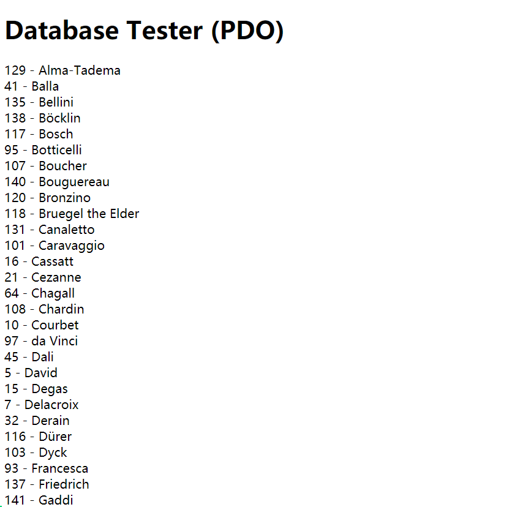
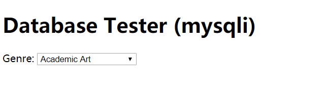
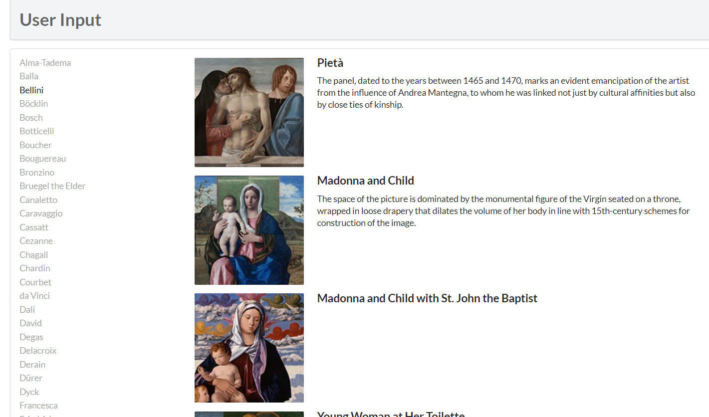

#  Lab10 设计文档

**卢雅棋 19302010063**



```
<?php require_once('config.php'); ?>
<!DOCTYPE html>
<html>
<body>
<h1>Database Tester (PDO)</h1> <?php
try {
  $pdo = new PDO(DBCONNSTRING,DBUSER,DBPASS);  
  $pdo->setAttribute(PDO::ATTR_ERRMODE, PDO::ERRMODE_EXCEPTION);  //通过setAttribute()方法来设置错误处理模式

  $sql = "select * from Artists order by LastName";//通过lastname进行排序并选择
  $result = $pdo->query($sql);//连接对象的query()方法，返回查询结果集
  while ($row = $result->fetch()) {
      echo $row['ArtistID'] . " - " . $row['LastName'] . "<br/>"; 
  }//将结果一行行输出
  $pdo = null; //断开连接
}catch (PDOException $e) { 
    die( $e->getMessage() );
}
?>  
</body>  
</html>
```


```
<?php require_once('config.php'); ?>
<!DOCTYPE html>
<html>
<body>
<h1>Database Tester (mysqli)</h1> Genre:
<select>
<?php  
$connection = mysqli_connect(DBHOST, DBUSER, DBPASS, DBNAME); //创建一个连接
if ( mysqli_connect_errno() ) {
   die( mysqli_connect_error() ); //连接错误就断开连接
}
$sql = "select * from Genres order by GenreName"; //按GenreName排序并选择
if ($result = mysqli_query($connection, $sql)) {
  // loop through the data
  while($row = mysqli_fetch_assoc($result)) {
     echo '<option value="' . $row['GenreID'] . '">'; 
     echo $row['GenreName'];
     echo "</option>";
  }
  // release the memory used by the result set
  mysqli_free_result($result); 
}
// close the database connection
mysqli_close($connection);
?>
</select>
</body>
</html>


```







```function outputPaintings() {
  function outputArtists() {
   try {
         $pdo = new PDO(DBCONNSTRING,DBUSER,DBPASS);
         $pdo->setAttribute(PDO::ATTR_ERRMODE, PDO::ERRMODE_EXCEPTION);//通过setAttribute()方法来设置错误处理模式
         $sql = "select * from Artists order by LastName limit 0,30";//通过lastname排序后选取0-30位
         $result = $pdo->query($sql);//连接对象的query()方法，返回查询结果集
         while ($row = $result->fetch()) { //每循环一次得到其中的一条记录
            echo '<a href="' . $_SERVER["SCRIPT_NAME"] . '?id=' . $row['ArtistID'] . '" class="';//获得当前脚本的链接，使id等于当前作者的id
            if (isset($_GET['id']) && $_GET['id'] == $row['ArtistID']) echo 'active ';
            echo 'item">';//isset()检测是否设置，如果id已经被设置就把class值设为active
            echo $row['LastName'] . '</a>';
         }
         $pdo = null;
   }
   catch (PDOException $e) {
      die( $e->getMessage() );
   }
}
```


```

function outputPaintings() {
    try {
        if(isset($_GET['id']) && $_GET['id'] > 0) { //如果id被设置且值大于0
            $pdo = new PDO(DBCONNSTRING,DBUSER,DBPASS);
            $pdo->setAttribute(PDO::ATTR_ERRMODE, PDO::ERRMODE_EXCEPTION);

            $sql = 'select * from Paintings where ArtistId=:id';//通过id选取对应作品
            $id = $_GET['id'];

            $statement = $pdo->prepare($sql);
            $statement->bindValue(':id', $id);//把值绑定到参数上
            $statement->execute();//执行

            while ($row = $statement->fetch()) {
                outputSinglePainting($row);//一行行打印
            }
            $pdo = null;
        }
    }catch(PDOException $e) {
        die( $e->getMessage() );
    }
}
```


```

function outputSinglePainting($row) {
   echo '<div class="item">';
   echo '<div class="image">';
   echo '';
   //打印图片
   echo '</div>';
   echo '<div class="content">';
   echo '<h4 class="header">';
   echo $row['Title'];
   //打印标题
   echo '</h4>';
   echo '<p class="description">';
   //打印描述
   echo $row['Excerpt'];
   echo '</p>';
   echo '</div>';  // end class=content
   echo '</div>';  // end class=item
}

```


1.使用连接对象的query()方法，返回查询结果集（result set）或FALSE，多用于查询语句

2.使用连接对象的exec()方法，返回受影响的行数

3.使用语句对象的execute()方法，用于支持预处理语句

其中使用预处理语句的优势有：

1.安全性更好，需要多次提交情况下性能更好

2.被预处理处理过的sql语句，都会提前被数据库处理存到缓存中，减小对数据库的压力，提高程序的运行速度；

3.防止用户的一些恶意行为