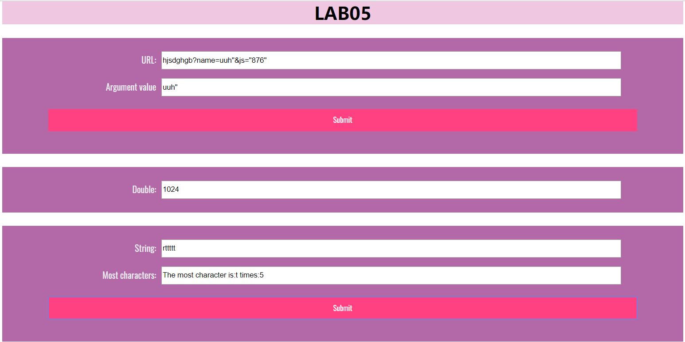
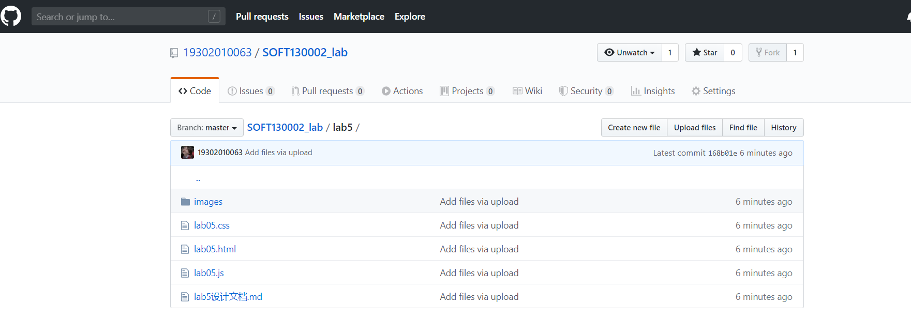

#  Lab5 设计文档

**卢雅棋 19302010063**

## 截图




## 第一部分

1创建正则表达式的模型

 ```
var expression = new RegExp("(^|&?)" + "name" + "=([^&]*)(&|$)", "i");//正则表达式的模型
    
```
2匹配成功则截取name的值：
 ```
 var str = url.value.substr(1).match(expression);  //获取url中字符串并与变量model匹配
        if (str != null) {
            url_result.value = unescape(str[2]);//使变量name的值显示在id为url_result的输入框中
        }
```

## 第二部分

1timeTest

 ```
let count = 0;//计数变量
    mul.value = 1;//初始化输入框
 var interval1 = setInterval(function () {
        count++;
        mul.value *= 2;//翻倍
    },5000);

    var interval2 = setInterval(function () {

        if(new Date().getSeconds() == 0 || count >= 10) {
            clearInterval(interval1);
            clearInterval(interval2);
        }
    },100);
}
    
```

## 第三部分

1获取字符串&创建储存数组
 
 ```
var str = most.value;//获取字符串
    var count = {};//创建空白数组储存

```
2循环记录每一个字符出现的次数
 ```
 for(var i = 0, length = str.length; i < length; i++){
        var char = str.charAt(i);//取每一个位置的字符
        if(count[char]){
            count[char]++;
        }
        else{
            count[char] = 1;
        }
    }

```
3循环比较处最大值和相对应的字符
 ```
 var max = 0;//次数
    var index = null;//字符
    for (var number in count){
        if (max < count[number]){
            max = count[number];
            index = number
        }
    }
```
