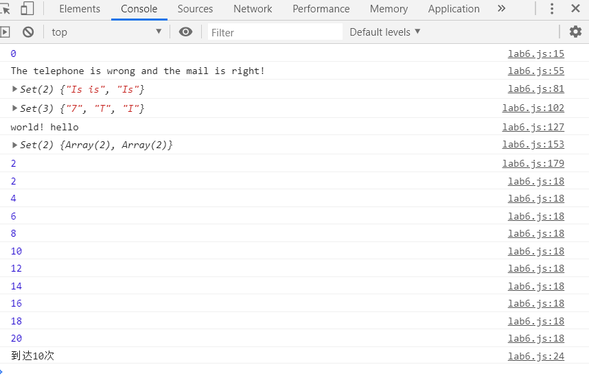

#  Lab6 设计文档

**卢雅棋 19302010063**

## 截图

## 正则表达式

 var expression1 = new RegExp("^(\\+\\d{2}-)?(\\d{2,3}-)?([1][3,4,5,7,8][0-9]\\d{8})$", "i");//电话的正则表达式的模型
 \\+ 是显示"+" 
 \\d{2} 是两位数字    
？匹配前面的子表达式零次或一次
$匹配输入字符串结尾的位置

var expression2 = new RegExp(" /^([a-zA-Z0-9_-])+@([a-zA-Z0-9_-])+((\\.[a-zA-Z0-9_-]{2,3}){1,2})$/", "i");//邮箱的正则表达式的模型
^([a-zA-Z0-9_-]) 开头可以是大小写字母、数字或者下划线
\.  转义
[a-zA-Z0-9_-]{2,3}) 有两位或者三位 
{1,2}最少匹配 1 次且最多匹配 2 次
+ 匹配前面的子表达式一次或多次

 var expression = /(\w+)\s\1+/i;
\w 任何ASCII字符组成的单词，等价于[a-zA-Z0-9]
\s任何unicode空白字符
ig全文查找、忽略大小写
\1上一个匹配到过的表达式

## 继承的不同方式

1原型链

 利用原型让一个引用类型继承另一个引用类型的属性和方法
PoorCountry.prototype = new Country();

2构造函数

子类型构造函数的内部调用超类型构造函数
function DevelopingCountry() {
    Country.call(this);
}

3object.create

创建一个新对象，使用现有的对象来提供新创建的对象
function DevelopedCountry() {
    Country.call(this);
}

DevelopedCountry.prototype = Object.create(Country.prototype);
DevelopedCountry.prototype.constructor = DevelopedCountry;

## set,array,map

1set元素无序，不重复，无索引
 
2array数组，可以储存对象和基本数据类型，长度固定

3map 键值是唯一的，不可重复